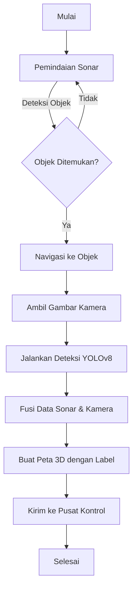

# Deteksi-Object-Bawah-Laut
# Deteksi Objek Bawah Laut dengan Kamera dan Sonar untuk AUV/ROV

## Gambaran Umum
Proyek ini mengintegrasikan **deteksi objek berbasis kamera** dan **sonar** pada drone bawah laut (AUV/ROV) untuk mendeteksi, melokalisasi, dan mengklasifikasi objek di lingkungan bawah laut yang penuh tantangan. Sistem ini menggabungkan data visual (dari kamera) dengan data akustik (dari sonar) untuk deteksi yang andal di kondisi visibilitas rendah, cocok untuk penelitian kelautan, pemantauan ekosistem, atau robotika bawah air.

## Arsitektur Sistem
- **Perangkat Keras**:
  - Drone bawah laut (contoh: BlueROV2) dengan kamera (HD/4K) dan sonar (contoh: Ping360 atau multibeam).
  - Prosesor embedded (contoh: NVIDIA Jetson Nano/TX2) untuk pemrosesan real-time.
  - Komunikasi: Modem akustik atau kabel tether untuk transmisi data.
- **Perangkat Lunak**:
  - **Deteksi Objek**: YOLOv8 (Python, Ultralytics) untuk deteksi visual real-time.
  - **Pemrosesan Sonar**: PySonar atau ROS untuk analisis data akustik.
  - **Integrasi**: ROS untuk sinkronisasi sensor dan fusi data.
  - **Jaringan**: Mikrotik untuk QoS guna memprioritaskan transmisi data drone.

## Alur Kerja
1. **Pemindaian Sonar**: Sonar memindai lingkungan, mendeteksi posisi dan ukuran objek melalui pantulan gelombang suara.
2. **Navigasi Drone**: Drone bergerak menuju objek yang terdeteksi menggunakan perencanaan jalur (contoh: algoritma A*).
3. **Deteksi Kamera**: Kamera merekam gambar/video, diolah oleh YOLOv8 untuk mengklasifikasi objek (contoh: ikan, karang, sampah).
4. **Fusi Data**: Menggabungkan data sonar (posisi) dan kamera (klasifikasi) menggunakan teknik seperti Kalman Filter.
5. **Keluaran**: Menghasilkan peta 3D dengan label objek, dikirim ke pusat kontrol.

## Diagram Alur
Diagram berikut menggambarkan alur kerja sistem:



## Tantangan dan Solusi
- **Visibilitas Rendah**: Sonar memastikan deteksi di air keruh; kamera digunakan hanya pada jarak dekat dengan iluminasi LED.
- **Sinkronisasi Data**: Timestamp ROS menyelaraskan data sonar dan kamera.
- **Efisiensi Daya**: Optimalkan YOLOv8 dengan pruning model; aktifkan kamera secara selektif.
- **Akustik Bawah Air**: Kalibrasi sonar untuk efek salinitas/suhu demi akurasi.

## Rekomendasi
- **Prototipe**: Uji dengan BlueROV2, Jetson Nano, dan sonar Ping360 di perairan dangkal.
- **Dataset**: Gunakan FathomNet untuk data kamera dan data sonar sintetis untuk pelatihan.
- **Jaringan**: Konfigurasi Mikrotik untuk transmisi data latensi rendah:
  ```plaintext
  /queue simple
  add name=drone-queue target=192.168.1.100 max-limit=20M/20M priority=1
  ```
- **Langkah Berikutnya**: Tentukan objek target (contoh: ikan, sampah) dan jenis sonar untuk pengembangan lebih spesifik.

## Ketergantungan
- Python 3.8+
- Ultralytics YOLOv8 (`pip install ultralytics`)
- ROS (Noetic/Melodic) untuk integrasi sensor
- OpenCV untuk pra-pemrosesan gambar
- PySonar untuk pemrosesan data sonar

## Catatan
- Pastikan perangkat keras drone tahan tekanan (contoh: IP68) untuk operasi laut dalam.
- Perhatikan optik bawah air (penyerapan cahaya merah) dan akustik (kecepatan suara ~1500 m/s, dipengaruhi salinitas/suhu).

Untuk detail lebih lanjut atau implementasi spesifik (contoh: kode Python/C++, konfigurasi jaringan), hubungi pemimpin proyek.
